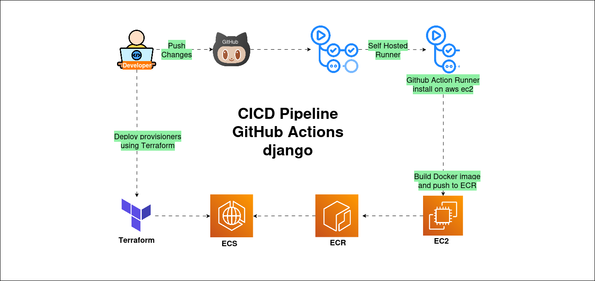

# Deploy Dockerize Django App on AWS ECS Fargate using GitHub Actions and Terraform

## Overview

This repository contains a pre-configured development environment for Django-based applications, enabling developers to set up a robust development environment with a single command.

## Article Link: 
## https://blog.aws-devops.blog/deploy-dockerize-django-app-on-aws-ecs-fargate-using-github-actions-and-terraform?showSharer=true

   

